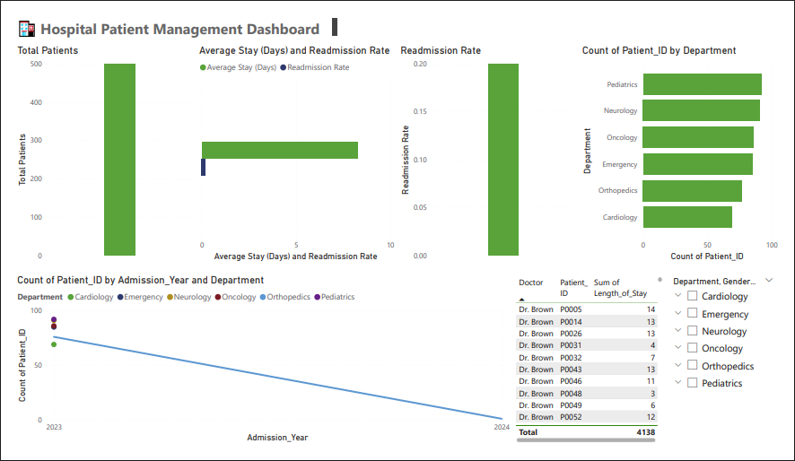

# 🏥 Hospital Patient Management Dashboard - Power BI 

This project is an interactive Power BI dashboard designed to analyze and monitor key metrics related to hospital operations, patient flow, and doctor performance. It provides hospital administrators with valuable insights to improve healthcare service quality, operational efficiency, and patient care.
   
---

## 📊 Dashboard Overview

The dashboard includes the following key components:

### ✅ KPI Cards
- **Total Patients**
- **Average Length of Stay**
- **Readmission Rate**
- **Mortality Rate**

### 📈 Trends
- Line chart showing patient admissions over time, segmented by department.

### 📊 Department Load
- Bar chart displaying patient volume by medical department.

### 👨‍⚕️ Doctor Performance
- Table showing number of patients treated and average stay per doctor.

### 🎛️ Interactive Filters (Slicers)
- Department
- Doctor
- Gender
- Admission Date

---

## 📁 Files Included

| File Name                         | Description                                |
|----------------------------------|--------------------------------------------|
| `Hospital_Patient_Management.pbix` | Power BI report file                        |
| `hospital_data_simulated.xlsx`     | Simulated healthcare dataset (Excel)        |
| `README.md`                        | This readme file                           |
| `/images/`                   | Folder containing dashboard screenshots     |

---

## 🧠 Key Learnings & Techniques Used

- Power BI **Data Modeling** using Power Query Editor
- Creating **custom DAX measures**:
  - Average Stay
  - Readmission and Mortality Rates
- Effective **data visualization design** and layout alignment
- Use of **slicers** for interactivity
- **Time-based analysis** using date hierarchy (yearly trends)

---

## 🏗️ Project Setup Instructions

1. Clone this repository or download the `.pbix` and dataset files.
2. Open the `Hospital_Patient_Management.pbix` file in Power BI Desktop.
3. If prompted, update the data source path to point to your local `hospital_data_simulated.xlsx`.
4. Explore, analyze, or extend the dashboard as needed.

---

## 🧪 Sample Visual Preview

---

## 🚀 Future Enhancements (Optional Ideas)

- Add drill-through pages for department-wise deep dives
- Integrate real-time hospital APIs (if available)
- Add predictive analytics (e.g., patient inflow forecasting)
- Build a mobile-friendly layout

---

## 📌 License

This project uses simulated data and is intended for learning and demonstration purposes only.
